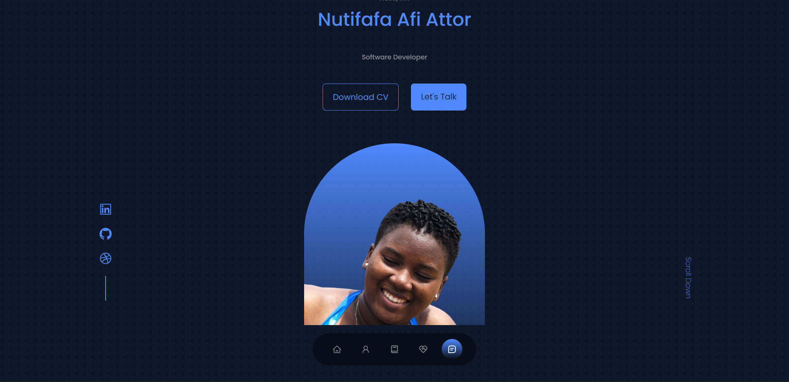
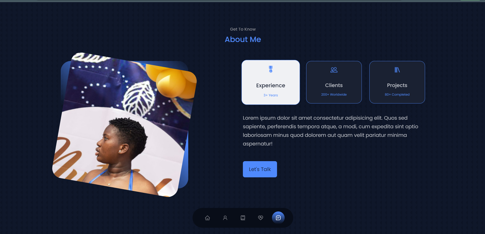
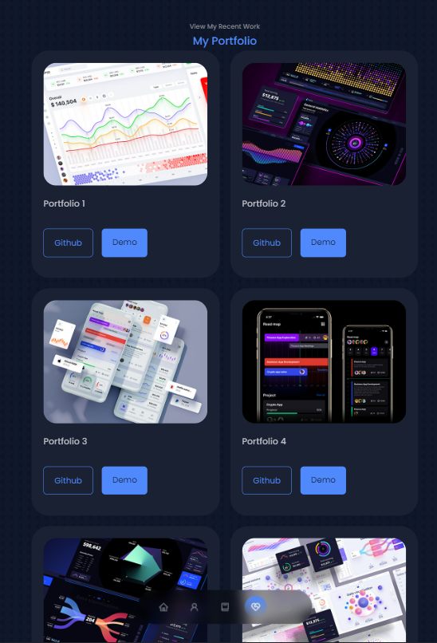
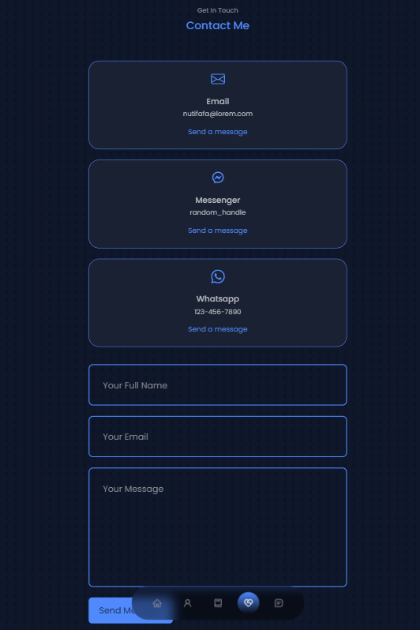
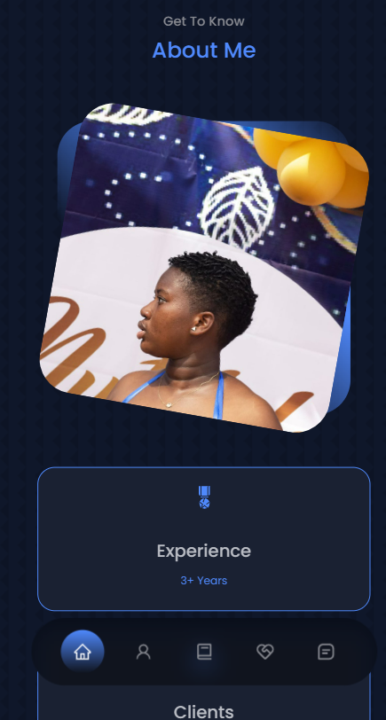
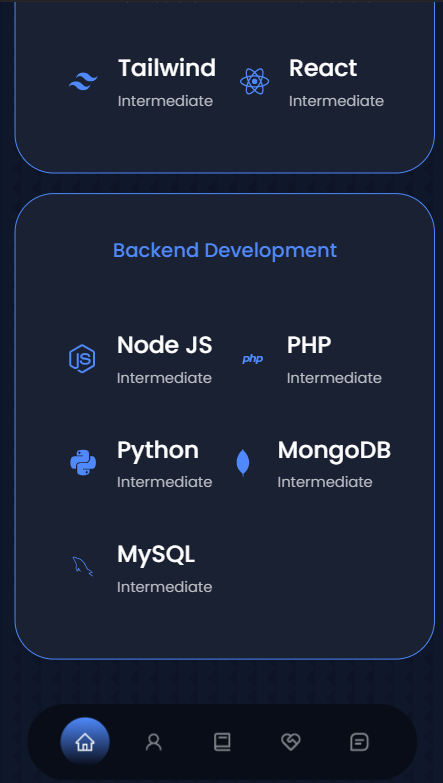
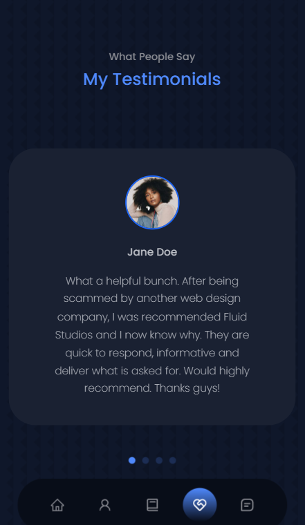

# React Portfolio

This project was bootstrapped with [Create React App](https://github.com/facebook/create-react-app).

## About
This is a simple portfolio site built with React. It is a clone of my current portfolio site [here](https://nutifafa.netlify.app/) with a few changes.
## Live Site
You can find the live site [here]().
## Experience
I would say that building with react was quite similar to using HTML CSS and JS to build a website. I learned a lot about the basics of React and how to use it to build a website. I enjoyed the concept of components and how they can be reused. This helped me to organise my code and make it more readable.
## What I Learned
- `React` is a library that allows you to build a website with components.
- I learnt how to use `map` method to loop through an array in objects to generate certain things dynamically.
- I learnt about the `useState` hook and how to use it to to manage the Nav States.
- I learnt about the `.jsx` extension and how to use it to make the code easier to write.

## Resources
1. [React](https://reactjs.org/)
2. [SwiperJs](https://swiperjs.com)
3. [Dribbble](https://dribbble.com/)
4. [React-icons](https://react-icons.github.io/react-icons)
5. [EmailJS](https://www.emailjs.com/)
## Things To Do
- [ ]  Deploy the site
## How It Looks
Below are some screenshots of the site.

### Large Screens

### Medium Screens

### Mobile Screens

## Learn More

You can learn more in the [Create React App documentation](https://facebook.github.io/create-react-app/docs/getting-started).

To learn React, check out the [React documentation](https://reactjs.org/).

